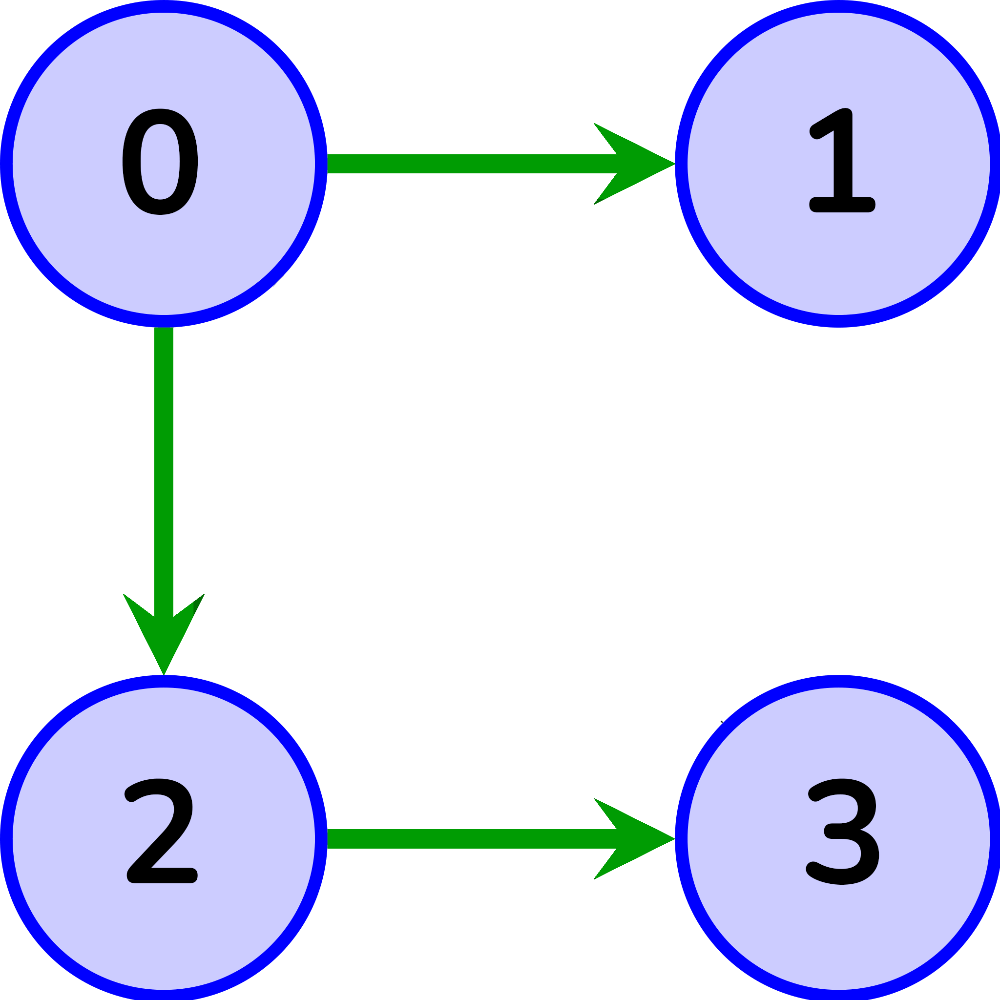

# Course Planner Algorithm
*algorithm design and analysis of the course algorithm of computer science engineering.*

There are a total of numCourses courses you have to take, labeled from `0` to `numCourses - 1`. You are given an array prerequisites where **prerequisites[i] = [Ai, Bi]** indicates that you must take course `Bi` first if you want to take course `Ai`.
* For example, the pair [0, 1], indicates that to take course 0 you have to first take course 1.

## Implementation
1. **function** `can_be_taken()`:

    Return `true` if you can finish all courses. Otherwise, return `false`.
    ```
    Input: numCourses = 2, prerequisites = [[1,0]]

    Output: true

    Explanation: There are a total of 2 courses to take. To take course 1 you should
    have finished course 0. So it is possible
    ```
    <hr>
2. **function** `ordering()`:

    Return the ordering of courses student should take to finish all courses. If there are many valid answers, it returns one of them. If it is impossible to finish all courses, returns an **empty array**.
    ```
    Input: numCourses = 4, prerequisites = [[1,0], [3,1]]

    Output: [0,1,3,2]

    Explanation: There are a total of 2 courses to take. To take course 1 you should
    have finished course 0. So the correct course order is [0,1].
    ```
    <hr>
3. **function** `query()`:

    Prerequisites can also be indirect. If course `a` is a prerequisite of course `b` and course `b` is `a`
prerequisite of course `c`, then course `a` is `a` prerequisite of course `c`.

    You are also given an array `queries` where `queries[j] = [uj, vj]`. For the `Jth` query, you should
answer whether course `uj` is a prerequisite of course vj or not.
Return a boolean array answer, where `answer[j]` is the answer to the `Jth` query.

    <p align="center">
        
    </p>

    ```
    Input: numCourses = 2, prerequisites = [[1,0], [2,0], [3,2]], queries = [[0,1],[3,0]]
    
    Output: [false,true]
    
    Explanation: The pair [1, 0] indicates that you have to take course 1 before you
    can take course 0. Course 0 is not a prerequisite of course 1, and for second one
    prerequisites are [2,0] and [3,2] so [3,0] is true.
    ```
    <hr>
4. **function** `study_plan()`:

    we have a student and to become a graduate, he has to take and pass a specific amount of courses `N`. Each of these N courses will be specified by a number and         prerequisites are given in the previous format. In each semester, he can take most `K` courses and he can study for free only for `M` semesters and after that M'th     semester, he has to pay a specific amount of money for each course. For semester `S(S>M)`, he has to pay `(S-M)*X$` for each course.
    
    ***Inputs***: N, M, X, K, and set of prerequisites
    
    ***Output***: output should be in the following format:<br>
    Semester #i: [set of courses taken during semester #i]<br>
    Semester #j: [set of courses taken during semester #j]<br>
    Semester #h: [set of courses taken during semester #h]<br>
    ...<br>
    Cost of this plan: (S-M)*X $

    ```
    Input: 8,2,100,4, [[1, 0], [2, 0], [3, 2], [1, 3], [5, 2]]
    
    Output:
    semesters #1: [0, 4, 6, 7]
    semesters #2: [2]
    semesters #3: [3, 5]
    semesters #4: [1]
    Cost of this plan: 400$
    ```
    
### Installation

1. clone the project using:

```bash
git clone https://github.com/Amir-Shamsi/course-planner-algorithm.git
```

2. take a look at [test file](tests/test_CourseOrdering.py) and run the project. 🎈
